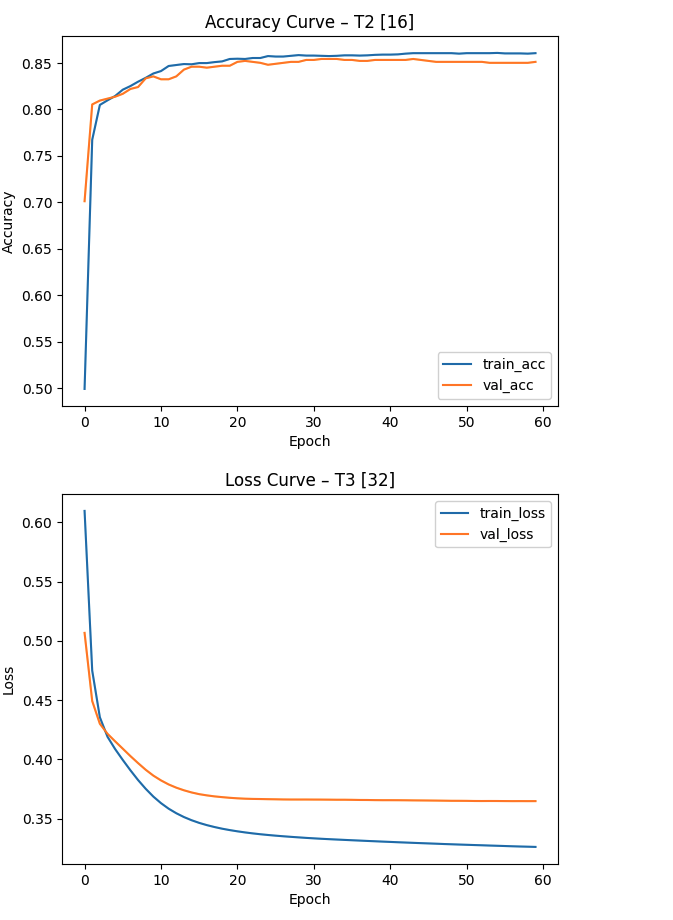

# ML Classification with Hyperparameter Tuning and Fairness Analysis

This project focuses on building and optimising a neural network classifier through systematic experimentation across architectures, optimizers, and batch sizes.

The final model achieved **85.67% accuracy**, while highlighting performance trade-offs and fairness considerations across demographic groups.

---

## Model Training Performance

The training curve below shows stable convergence with minimal overfitting, indicating effective generalisation of the model.



---

## What I Did

- Designed and compared 8 neural network architectures  
- Evaluated multiple batch sizes and optimizers (SGD, RMSProp, Adam)  
- Applied dropout and L2 regularisation to reduce overfitting  
- Performed grid search to identify optimal hyperparameters  
- Analysed performance using confusion matrix and per-class metrics  
- Conducted fairness analysis across gender and age groups  

---

## Key Results

- **Best model:** Adam, batch size 64, 60 epochs  
- **Test Accuracy:** 85.67%  
- Strong performance on majority class (recall ~0.97)  
- Lower recall for minority class (~0.41), highlighting class imbalance  
- Minimal fairness gap across gender (~1–2%)  

---

## Why This Matters

This project demonstrates a complete machine learning workflow — from experimentation and tuning to evaluation and fairness analysis — reflecting practical, real-world ML development.

It also highlights that model performance is not only about accuracy, but how consistently the model performs across different groups.

---

## Tech Stack

- Python  
- TensorFlow / Keras  
- NumPy, Pandas  
- Matplotlib / Seaborn  
- Scikit-learn  

---

## How to Run

1. Install dependencies:
   ```bash
   pip install -r requirements.rtf
